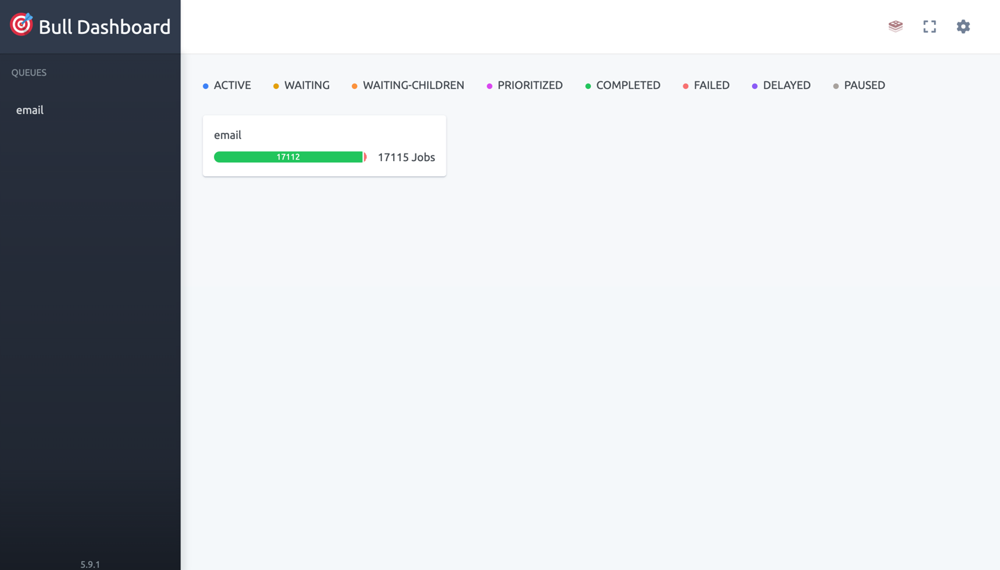

# Rate Limit Demo

This is a simple demo for simulating a rate limiter with BullMQ.

## Tools

- [NestJS](https://nestjs.com/)
- [BullMQ](https://docs.bullmq.io/)
- [Bull Board](https://github.com/felixmosh/bull-board)
- [Redis](https://redis.io/)
- [Docker](https://www.docker.com/)

## Getting Started

## Setup Environment
1. Create a `.env` file in the root of the project
   1. You may use the `.env.example` file as a template

### Install Dependencies
```bash
$ yarn
```

### Setup Services
```bash
$ docker-compose up -d
```

### Start Server
```bash
$ yarn start:dev
```

### Simulate Requests
```bash
$ yarn simulate
```

## Observability
1. Open Browser
2. Navigate to the [Bull Board](http://localhost:3000/admin/queues/)

3. 